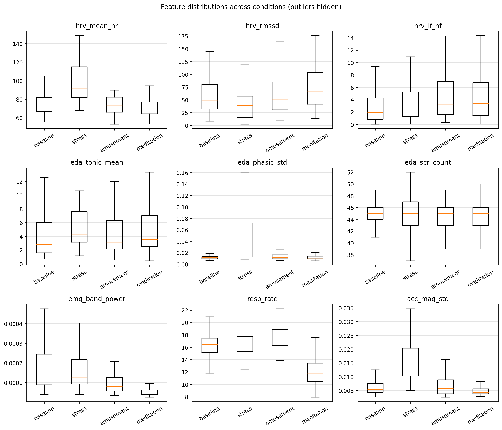
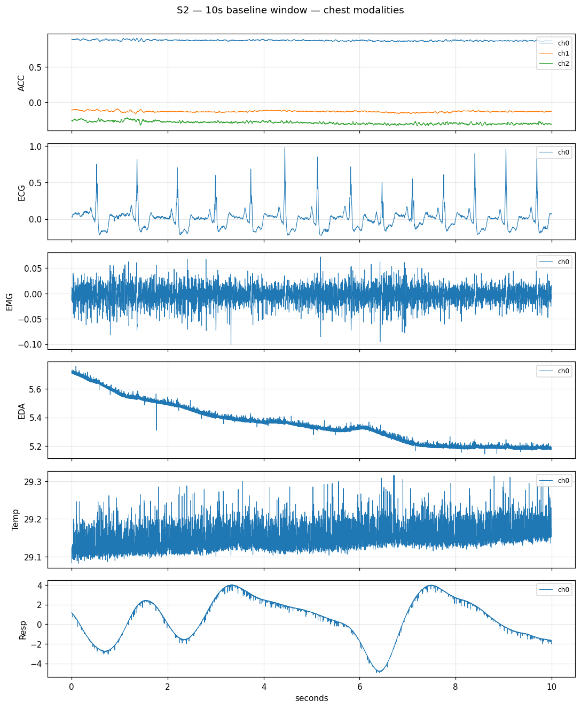
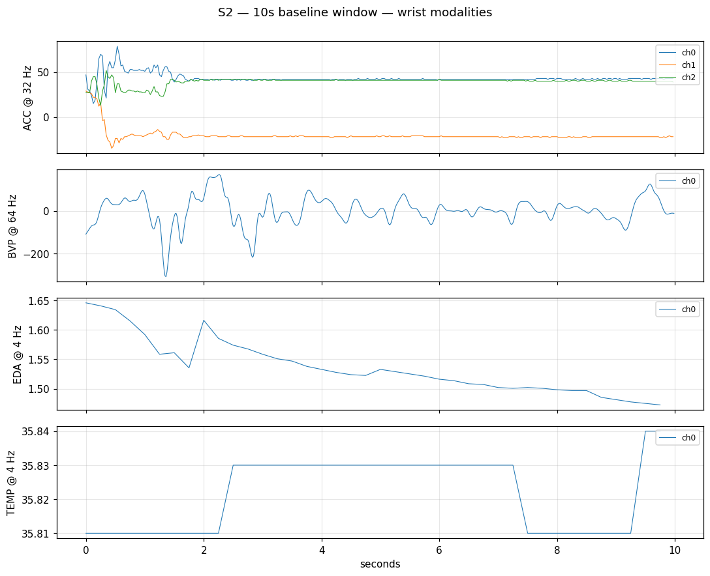
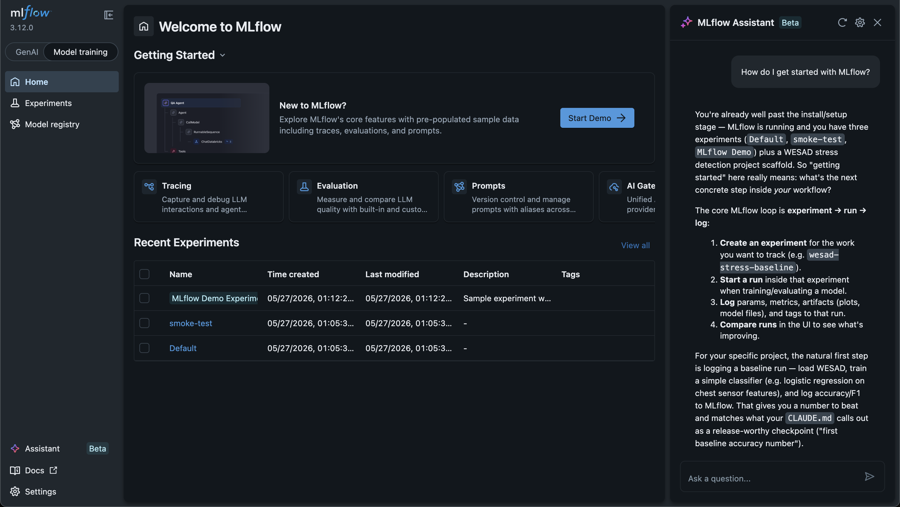

# Changelog

## Upcoming

### Preprocessing and splits

60-second windows with overlap, leave-one-subject-out (LOSO) cross-validation as the primary protocol. Both classical features (HRV from ECG, phasic + tonic decomposition from EDA, respiration-rate features) and raw windowed signals get prepared — they feed different model families and the comparison is part of the point.

### Baseline models

LSTM in PyTorch first, end-to-end through MLflow tracking — the goal of the LSTM is not the best number, it's a credible reference and a working training loop. Then a small 1D CNN, which is usually a better fit for short-window physiological signals where the relevant patterns are local. Both evaluated under LOSO with confusion matrices and learning curves.

### Feature-engineered vs raw

The more interesting axis. Classical pipelines (HRV / SCR features fed into logistic regression or gradient boosting) often beat deep models on small datasets like WESAD. The ablation table compares feature-eng + classical, feature-eng + LSTM/CNN, and raw + LSTM/CNN, across single-modality (chest-only, wrist-only) and fused configurations.

### Writeup

Once results land, fill in the README's Why and Results sections, and write a longer-form blog post linked from there. Emphasis on what was surprising rather than the headline accuracy number.

## 2026-06-02

### Feature extraction — first pass

`features.py` ships a hand-rolled chest-signal feature set — HRV from ECG, tonic/phasic EDA, EMG envelope + spectral, respiration, accelerometer — over 60 s / 30 s-step windows; `python -m wesad_stress.features` builds a 1 422-window × 19-feature table across all 15 subjects. Contract in `docs/features.md`, term definitions in `docs/glossary.md`, and the paper's full Table 1 catalogue (the superset we're a subset of) in `docs/wesad-paper-features.md`. Notebook `notebooks/01-features.ipynb` does the first read.

The per-condition distributions separate roughly where the physiology predicts — and where they don't is the more useful signal. `hrv_mean_hr` (≈91 vs ≈70–74 bpm) and `eda_phasic_std` are the cleanest stress markers, while `resp_rate` (≈12 vs ≈16–17 breaths/min) turns out to be a meditation marker, not a stress one. Two honest caveats fell out: `eda_scr_count` and `hrv_lf_hf` barely separate anything as built — the SCR count saturates and the short-window LF/HF estimate is noisy enough to mis-order the conditions — and `acc_mag_std` "detects" stress largely because the stress task has the subject standing and speaking, a motion confound to watch when the classifier lands rather than real physiology. Boxes are wide and adjacent conditions overlap, so per-subject normalisation before modelling looks necessary; baseline vs amusement is the hardest pair, the expected fingerprint of amusement being high-arousal-but-positive.



## 2026-05-28

### Download

The UCI "WESAD.zip" download link is a 261-byte stub containing a sciebo redirect URL — and the token in that stub is stale as of 2026. The live download is on the [Siegen lab's official page](https://ubi29.informatik.uni-siegen.de/usi/data_wesad.html), which currently points at `https://uni-siegen.sciebo.de/s/HGdUkoNlW1Ub0Gx/download`. Sciebo's download endpoint also doesn't send a useful `Content-Length`, so curl's `--progress-bar` flag silently produces no visible progress; the default progress meter (no flag) shows live bytes and rate. README has the corrected one-liner.

### Data ingest

`load_wesad()` ships, `docs/schema.md` documents the contract it returns. Subject S2 round-trips through the loader cleanly — chest at 700 Hz across all six modalities, wrist at the published per-sensor rates (32 / 64 / 4 / 4 Hz), label distribution matches the documented protocol. Notebook `notebooks/00-load-one-subject.ipynb` exercises the loader end-to-end and saves 10-second baseline plots for both devices.

A few surprises while writing the schema doc. Chest sessions are ~100 minutes long, not the ~60 I'd lazily assumed. `chest/Temp` is `float32` while every other chest signal is `float64`. Wrist ACC is exposed as raw int8 counts (±128), not g-units. And label 0 (transient) is roughly half the recording — most of a WESAD session is protocol setup, instructions, and inter-block transitions, not modelling-grade data. Anything that doesn't filter on label first will be modelling mostly transients.

| Chest | Wrist |
|---|---|
|  |  |

## 2026-05-27

### Middleware

MLflow 3.x's security middleware rejects any request whose port-qualified Host header (e.g. 127.0.0.1:5000) isn't in `--allowed-hosts`, so the allowlist must include the port — otherwise the UI returns `403 Invalid Host` header.

```bash
uv run mlflow ui \
  --backend-store-uri sqlite:///mlflow.db \
  --host 127.0.0.1 \
  --allowed-hosts 127.0.0.1:5000,localhost:5000
```

### MLflow UI

[MLflow AI Assistant](https://mlflow.org/docs/latest/genai/getting-started/try-assistant/) works with coding agents like Claude Code. 🎉


